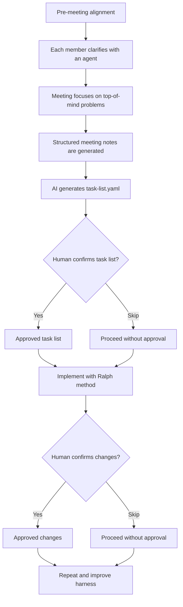
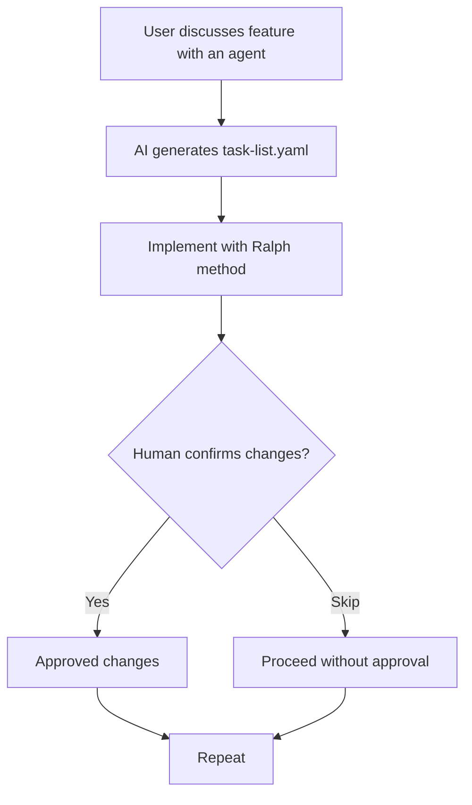

# Team Delivery Workflow

## Purpose

This process is designed to:

- keep humans focused on intent, prioritization, and approval
- let non-developers participate without needing to write implementation details themselves
- generate task lists that are specific enough for autonomous execution
- reduce back-and-forth caused by vague requirements
- improve the harness over time as the team learns where ambiguity still leaks through

## Scope and assumption

- The "Ralph method" is assumed to be your existing coding and validation workflow.
- This document defines the upstream planning system that produces implementation-ready inputs for Ralph.
- If Ralph already has stronger gates than the ones below, keep them. This workflow strengthens the input quality; it does not replace downstream quality control.

## Core principles

- Humans decide the outcome, priority, and tradeoffs.
- Agents convert intent into a structured, implementation-ready `task-list.yaml`.
- No task should enter implementation with avoidable ambiguity.
- If the AI cannot resolve a detail confidently, it should keep that work out of `task-list.yaml` instead of guessing.
- Unrelated meeting chatter should be excluded from the task list file.
- Human checkpoints are optional and should be inserted only where the risk justifies the interruption.
- Every cycle should produce harness feedback so future cycles need less human rescue.

## Standard artifacts

| Artifact | Purpose | Minimum contents | Exit condition |
| --- | --- | --- | --- |
| Pre-meeting briefs | Gather what each person wants from the meeting | desired outcome, pain point, constraints, urgency | each participant has stated their goal clearly enough to discuss |
| Structured meeting notes | Capture the live conversation in a format the AI can parse reliably | decisions, constraints, task candidates, open questions, parking lot | note set is organized by topic and labels are visible |
| Task list file | Convert meeting output into implementation-ready tasks | `task-list.yaml` containing only implementation-ready tasks in execution order | the file can be consumed directly by Ralph without hidden assumptions |
| Ralph handoff | Give the implementation agent the exact work contract | task list file, repo context, constraints, quality gates | the execution agent can begin without hidden assumptions |
| Change report | Summarize what was implemented and how it was verified | files changed, checks run, unresolved risks, follow-ups | humans can review only if needed |
| Harness feedback | Improve the process after each cycle | recurring ambiguity, missed validations, noisy prompts, review misses | at least one improvement candidate is captured when useful |
| Task list schema | Define the standard task list structure | Markdown schema for `task-list.yaml` | upstream prompts and Ralph use the same contract |

## Workflow diagrams

### Team workflow

### Individual workflow

## Workflow 1: Team mode

This workflow fits a team that wants everyone involved in deciding what to build, while keeping implementation mostly agent-driven.

### Step 1: Pre-meeting alignment

Before the meeting, send each participant a short prompt asking:

- What do you want to get out of this meeting?
- What problem or opportunity is driving that request?
- What constraints matter?
- What decision do you need from the group?
- What would a successful outcome look like by the end of the meeting?

The goal is not to solve the work yet. The goal is to make sure every participant arrives with a clear statement of intent.

### Step 2: Individual clarification with an agent

Each participant spends a short session with an agent before the meeting. The agent should:

- turn vague ideas into sharper statements
- surface missing details that would block a decision later
- separate must-haves from nice-to-haves
- identify assumptions and open questions
- prepare a concise brief that the meeting can work from

This step is especially important for non-developers because it lets them contribute clear intent without needing to invent technical solutions.

Use [the clarification prompt](/Users/jeff/Dev/projects/workflow/prompts/clarify-ideas-into-task-pack.md) for this step.

### Step 3: Run the meeting around top-of-mind problems

The meeting should focus on the problems and decisions that matter most right now. A good structure is:

1. Restate the meeting goal.
2. Round-robin each participant's top-of-mind need.
3. Group related topics.
4. Resolve the highest-priority decisions first.
5. Translate decisions into concrete task candidates before moving on.
6. Put unrelated or lower-priority conversation into a parking-lot section.
7. End with a readback of decisions, tasks, and unresolved questions.

### Step 4: Generate structured meeting notes

Meeting notes should be produced automatically if possible, but they need structure. Raw transcript quality is usually not enough on its own. The notes should clearly separate:

- decisions that were actually made
- requirements and constraints that were stated
- task candidates that were agreed
- open questions that still block implementation
- non-work or unrelated discussion

Use [the meeting template](/Users/jeff/Dev/projects/workflow/templates/structured-meeting-template.md) to keep the notes parseable.

### Step 5: Generate `task-list.yaml`

Run the meeting notes through [the extraction prompt](/Users/jeff/Dev/projects/workflow/prompts/extract-tasks-from-meeting-notes.md). The output should:

- exclude unrelated conversation
- consolidate duplicates
- include only implementation-ready tasks
- match [the shared schema](/Users/jeff/Dev/projects/workflow/schemas/task-list.schema.md)
- produce a single file named `task-list.yaml`

### Step 6: Optional human confirmation

Only insert human review here if the cost of a wrong task list is meaningfully higher than the cost of the interruption. A lightweight confirmation is often enough:

- approve the task list as-is
- correct one or two assumptions
- re-prioritize the order
- explicitly defer items that should not enter the file yet

### Step 7: Implement via Ralph method

Once `task-list.yaml` is clean, hand it off to the Ralph-method execution harness. Ralph should receive:

- the task list file
- repository context
- relevant architectural constraints
- required quality gates
- expected reporting format

Implementation should happen task by task, with validation at each step.

### Step 8: Optional human confirmation of changes

This checkpoint is most useful when:

- the changes affect product behavior in a visible way
- the work includes sensitive data or business rules
- the task list contained approved assumptions
- the team is still calibrating trust in the harness

If confidence is already high, this review can be reduced or skipped.

### Step 9: Repeat and improve

At the end of each cycle, capture:

- where tasks were still ambiguous
- where the harness missed something a human later caught
- where the meeting format created noisy notes
- which clarifying questions kept repeating

Those improvements should feed back into prompts, templates, and validation rules.

## Workflow 2: Individual mode

This workflow fits a single person who wants to move from idea to implementation with minimal friction.

### Step 1: Clarify the desired feature with an agent

The user describes the feature, pain point, or desired outcome. The agent should:

- restate the goal in plain language
- ask only the most important follow-up questions
- propose defaults where low-risk assumptions are acceptable
- separate facts from assumptions
- produce `task-list.yaml` only when the tasks are concrete enough to execute

Use [the clarification prompt](/Users/jeff/Dev/projects/workflow/prompts/clarify-ideas-into-task-pack.md) here as well.

### Step 2: Create `task-list.yaml`

The output should be a single task list file, not a loose brainstorm. Each task should have a clear goal, concrete steps, and clear done-when conditions.

### Step 3: Implement via Ralph method

Once the file contains only implementation-ready tasks, pass it into Ralph with the same handoff contract used in team mode.

### Step 4: Optional human confirmation

Review is optional and can be reserved for high-risk work, user-facing changes, or major architectural decisions.

### Step 5: Repeat

Any new feature request should start the same way: clarify intent first, then execute.

## Recommended meeting structure

The meeting structure matters because the better the notes are organized, the less cleanup the extraction agent has to do before producing `task-list.yaml`.

### Roles

- Facilitator: keeps the conversation on the current topic and moves unrelated items to parking lot.
- Participants: speak to the problem, constraints, and desired outcome.
- Note generator or note taker: records each topic using the structured labels.
- Planning agent: later converts the notes into `task-list.yaml`.

### Suggested agenda

| Segment | Goal | Output |
| --- | --- | --- |
| Opening context | restate why the meeting exists | shared success criteria |
| Participant round-robin | hear each person's top-of-mind issue | list of decision topics |
| Topic-by-topic discussion | decide on one topic at a time | decisions, constraints, task candidates |
| Task-definition pass | turn each decision into work | draft tasks and blockers |
| Final readback | confirm what was decided | decisions, task list, open questions, parking lot |

### Meeting rules that improve task extraction

- Discuss one decision topic at a time.
- State explicit decisions out loud instead of implying them.
- Label assumptions as assumptions.
- When a task is mentioned, say what outcome it should produce.
- Separate "must have" from "nice to have."
- Put unrelated conversation into a parking-lot section immediately.
- End each topic with a short recap before moving on.

### Labels to use in the notes

If the meeting tool supports tags or structured summaries, use these labels:

- `DECISION`
- `TASK CANDIDATE`
- `CONSTRAINT`
- `ASSUMPTION`
- `OPEN QUESTION`
- `PARKING LOT`

These labels make it far easier for the extraction prompt to separate signal from noise.

## Task list quality standard

A task is only implementation-ready if it meets all of the following:

- The desired outcome is clear.
- The scope is bounded.
- The change is connected to a real decision or requirement.
- Dependencies are explicit when they matter.
- The implementation steps are concrete.
- The done-when conditions are testable.
- Blocking questions are either answered or clearly separated from the task.

### Required structure for each task

The shared file format is defined in [task-list.schema.md](/Users/jeff/Dev/projects/workflow/schemas/task-list.schema.md). Each task in `task-list.yaml` must use:

- `id`
- `title`
- `goal`
- `steps`
- `depends_on`
- `done_when`
- `notes` optional

### What should never appear as a ready task

- vague goals such as "improve onboarding"
- tasks that depend on unstated product decisions
- implementation requests without success criteria
- bundles of unrelated changes combined into one task
- brainstorm ideas that were never agreed to

If an item cannot meet the standard above, it should stay out of `task-list.yaml` until it is clarified.

## Handoff contract to Ralph method

Ralph should only receive work after `task-list.yaml` is cleaned up.

### Input contract

The handoff should include:

- `task-list.yaml`
- repo or system context
- relevant constraints and non-goals
- validation requirements
- review requirements, if any
- output format for the final change report

### Execution rules

Ralph should:

- work from `task-list.yaml`, not from raw meeting notes
- stop expanding scope unless the task explicitly requires it
- surface blocking ambiguity immediately
- run the agreed validation harness
- report completed work, failed checks, and residual risks

### Output contract

Ralph should return:

- completed tasks
- skipped or blocked tasks
- files or systems changed
- checks run and results
- unresolved risks
- suggested harness improvements when useful

## Human review policy

Because human attention is the main bottleneck, review should be selective.

### Good places to keep humans in the loop

- choosing the problem to solve
- confirming product or business tradeoffs
- approving risky assumptions
- reviewing user-facing changes when trust is still being calibrated

### Good places to remove humans from the loop

- converting well-structured notes into `task-list.yaml`
- implementing low-risk tasks with strong validation
- generating summaries and change reports
- collecting repeated harness feedback

## Continuous improvement loop

This workflow should improve over time. After each cycle, ask:

- Which questions kept repeating?
- Which ambiguities should have been blocked earlier?
- Which meeting habits created noisy notes?
- Which checks should move into the harness?
- Which approvals were unnecessary?

Use those answers to update:

- prompts
- meeting templates
- validation scripts
- review thresholds

## Recommended artifacts in this workspace

- [Meeting-note task extraction prompt](/Users/jeff/Dev/projects/workflow/prompts/extract-tasks-from-meeting-notes.md)
- [User clarification prompt](/Users/jeff/Dev/projects/workflow/prompts/clarify-ideas-into-task-pack.md)
- [Task list schema](/Users/jeff/Dev/projects/workflow/schemas/task-list.schema.md)
- [Example task list](/Users/jeff/Dev/projects/workflow/examples/task-list.example.yaml)
- [Structured meeting template](/Users/jeff/Dev/projects/workflow/templates/structured-meeting-template.md)

## Suggested facilitator message before a team meeting

You can send a message like this before the meeting:

> Before the meeting, please send three short notes: what you want to get out of the meeting, what problem or opportunity is driving it, and any constraints or deadlines we should know. If useful, spend a few minutes with the clarification agent first so we can arrive with sharper requests and leave with cleaner tasks.

## Final note

The quality of autonomous implementation depends less on how smart the coding agent is and more on how explicit `task-list.yaml` is. This workflow is designed to make that file trustworthy.
